# 🎨 ComfyUI-productfix

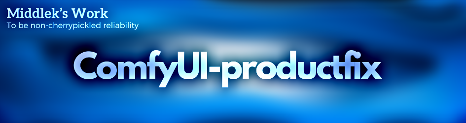

e-commerce 상품의 텍스트, 로고, 디테일 등을 유지하면서 이미지를 생성할 수 있도록 도와주는 ComfyUI 커스텀 노드입니다.

## 🎬 Demo


스마트폰으로 찍은 내 방 물건(색보정 X)들로 생성한 AI 이미지

## 📌 Index

- [Introduction](#-introduction)
- [Features](#-features)
- [Application](#️-application)
- [Approach](#-approach)
- [Install](#-install)
- [How to use](#-how-to-use)

## 🚀 Introduction

Stable diffusion으로 생성한 이미지는 시각적으로 자연스럽고 충실도가 높은 이미지를 생성하지만, 생성 과정에서 입력 객체가 변형되는 문제가 있습니다. 만약 객체에 텍스트와 브랜드 로고 같이 인위적 규칙성을 가진 요소에서 이 문제가 두드러집니다. 이런 **변형 문제는 e-commerce 환경에서 판매하는 실제 상품에 적용할 경우 심각한 제약**으로 작용합니다.

**Productfix**는 입력 객체의 특성(텍스트, 로고, 디테일 등)을 유지하면서 이미지를 생성할 수 있는 **Latent injection**이라는 AI application을 제공합니다. 또한 객체의 세부 사항을 보존하는데 도움이 되는 추가적인 노드 제공합니다. 

이 노드를 통해 기존의 디자인 툴(포토샵, 일러스트레이터 같은)로 해야만 했던 후처리 작업을 대폭 줄일 수 있을 것으로 기대합니다. ComfyUI에서 custom node를 통해 여러분의 워크플로우에 통합할 수 있습니다.

## 💡 Features

<details>
  <summary><strong>Apply Latent Injection</strong></summary>
  <ul>
    <li>ComfyUI의 KSampler 노드를 hijack하여 Latent injection을 수행하도록 설정합니다.</li>
    <li>실행이 완료되면 본래 KSampler 노드로 복구합니다.</li>
  </ul>
</details>

<details>
  <summary><strong>Get Text Mask</strong></summary>
  <ul>
    <li>Easy OCR 패키지를 이용하여 Text Mask를 Tensor로 불러오는 노드입니다.</li>
    <li>Easy OCR custom node는 이미 존재하지만(<a href="https://github.com/JaidedAI/EasyOCR">https://github.com/JaidedAI/EasyOCR</a>), PIL 패키지 사용방법이 stable하지 않기 때문에 이 노드 사용을 추천합니다.</li>
  </ul>
</details>

<details>
  <summary><strong>Reset Model Patcher Calculate Weight</strong></summary>
  <ul>
    <li>다른 node에서 Modelpatcher의 calculate weight 함수를 injection했다면 오류가 발생하는 custom node가 다수 존재합니다.(ex: comfyui-inpaint-nodes <a href="https://github.com/Acly/comfyui-inpaint-nodes">https://github.com/Acly/comfyui-inpaint-nodes</a>)</li>
    <li>이를 원본 Modelpatcher의 calculate weight로 reset하여 문제를 해결하는 노드입니다.</li>
  </ul>
</details>

## 🏃🏻‍♂️ Application
- ### **Comparing “IC-Light + Text” / “IC-Light + Text + Latent Injection”**
    
    condition / Input / IC-Light / **latent injection($\sigma_{end}$=1.0)** / **latent injection($\sigma_{end}$=0.5)**
    
    prompt: product photo, professional photography, realistic, leaf, outdoors / seed: 42

- ### **Comparing “IC-Light + IP-Adapter” / “IC-Light + IP-Adapter + Latent Injection”**
    
    condition / Input / IC-Light / **latent injection($\sigma_{end}$=1.0)** / **latent injection($\sigma_{end}$=0.5)**
    
    prompt: product photo, professional photography, realistic / seed: 42
    <br/><br/>
    Latent injection은 IC-Light와 IP-Adapter를 함께 사용할 때 진가를 발휘합니다.템플릿 스타일 이미지와 상품을 합성할 때 사용해보세요!
- ### **IC-Light + controlnet + text condition + Text transfer + Latent Injection**

    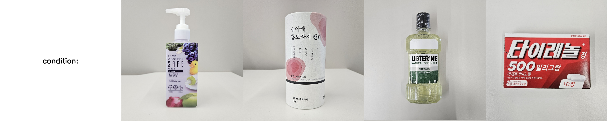
    Items in my room captured with my phone camera
    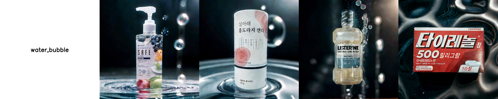
    prompt: product photo, professional photography, realistic, water, bubble / seed: 42 / controlnet: depth
    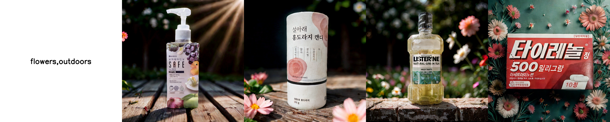
    prompt: product photo, professional photography, realistic, flowers, outdoors / seed: 42 / controlnet: depth
- ### **IC-Light + controlnet + IP-Adapter + Text transfer + Latent Injection**

    
    Items in my room captured with my phone camera

    

    prompt: product photo, professional photography, realistic / seed: 42 / controlnet: depth

    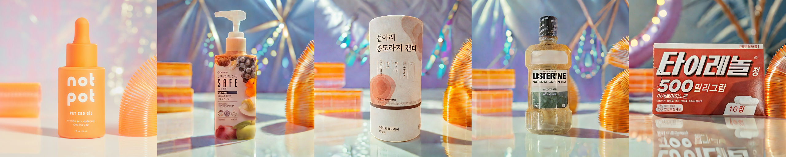
    prompt: product photo, professional photography, realistic / seed: 42 / controlnet: depth
- ### **Text transfer**

    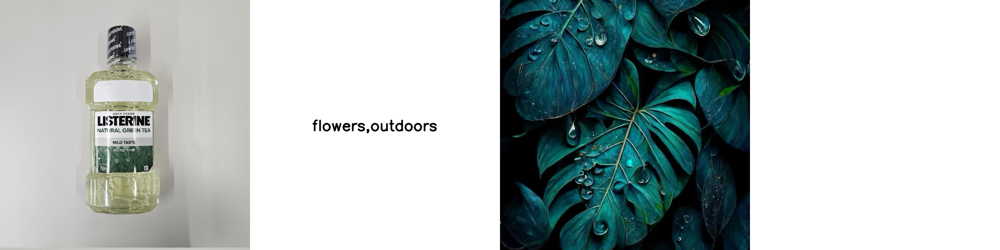
    Input / text condition / image condition(IP-Adapter)

    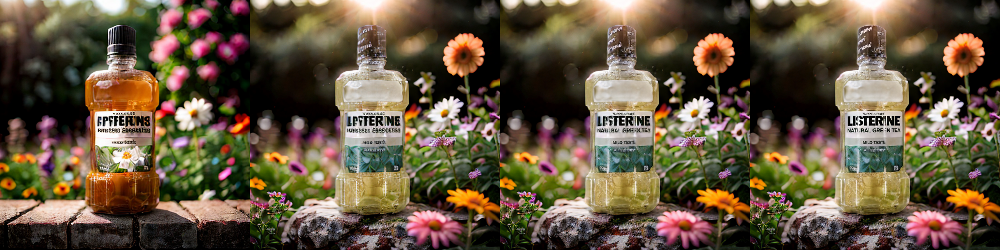
    only IC-Light / **Latent injection** / detail transfer / **Text transfer**
    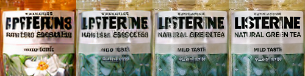
    close up
    <br/><br/>
    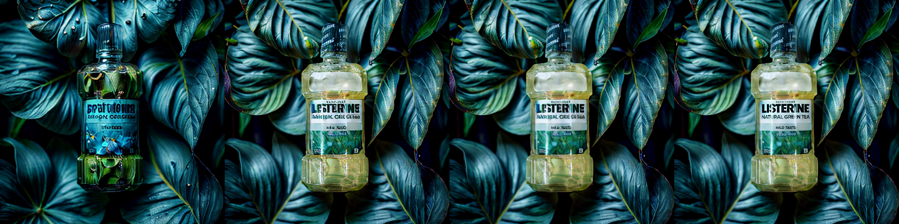
    only IC-Light / **Latent injection** / detail transfer / **Text transfer**
    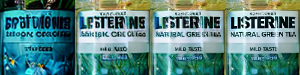
    close up
    <br/><br/>
    Text transfer는 입력 객체의 텍스트를 보존하기 위해 개발된 OCR 텍스트 마스크 기반 Detail transfer application입니다. `GetTextMask` node와 `DetailTransfer` node를 활용해 구현 가능합니다.

- ### **Upscaled results + Text detail transfer**
    


## 🛠 Approach

- ### Background: Inpainting
Diffusion 모델의 Inpainting은 마스크를 조건으로 이미지를 생성합니다. 각 샘플링 단계에서 마스크를 기준으로 원본과 생성된 잠재 공간을 합성합니다. 이 방법은 입력 객체를 유지하면서 마스크 영역을 생성할 수 있지만, **저품질 입력 객체(예: 스마트폰으로 촬영)의 경우 결과 이미지 품질도 저하되는 한계**가 있습니다.

- ### Background: IC-Light
IC-Light는 전경과 배경의 조명을 조작하는 혁신적인 Adapter Unet입니다. 입력 객체의 재조명을 통해 저품질 객체도 우수한 결과 이미지로 변환합니다. 그러나 **전경 생성 과정에서 객체 세부 사항이 변형되는 문제**는 여전히 존재합니다.

- ### Background: Kandinsky Inpainting Process
Kandinsky diffusion inpainting은 일반적인 inpainting과 차이가 있습니다. 샘플링 단계마다 잠재 공간을 합성할 때, **원본 대신 scheduler의 sigma 값에 따른 노이즈가 추가된 잠재 공간을 사용**합니다. 이 방식은 일관된 노이즈를 통해 품질 향상을 이끌어냅니다.

- ### Background: CLIP Skip
CLIP Skip은 텍스트 조건을 적용할 때, **샘플링 과정의 마지막 단계까지 적용하지 않고 중간에 중단하는 추론 방법**입니다. 이는 조건을 제어하여 전체 맥락에 부합하는 결과 이미지를 생성하는 효과가 있습니다.

- ### Solution: Latent injection
    
    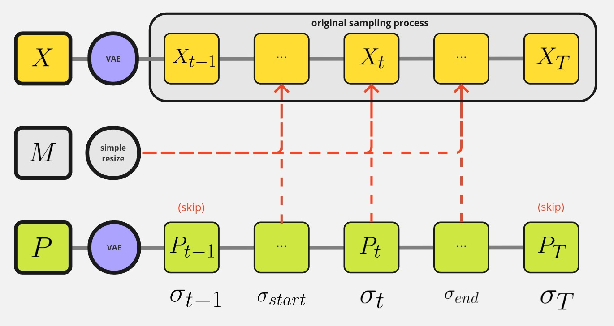
    
    $$
    X_t=\begin{cases}
    CO(X_{t}\cdot M,(P+\eta\cdot\sigma_t)\cdot inv(M),&\sigma_{end} \leq \sigma_t \leq  \sigma_{start} \\ 
    X_t,& otherwise\end{cases}
    $$
    
    $X_t$ : sample
    
    $M$ : product mask
    
    $P$ : product latent
    
    $CO$ : composition operation(ex: add, overlay, soft light etc.)
    
    입력 객체의 특징 보존과 의미 있는 조명 변화를 동시에 달성하기 위해 복합적인 전략을 적용합니다. **샘플링 과정에서 노이즈가 추가된 잠재 공간을 복합 연산하여 객체의 세부 특징을 유지**합니다. 또한 IC-Light의 전역적 조명 변화 특성을 반영하기 위해 **샘플링의 초기와 후기 단계를 선택적으로 건너뜁니다.** 이 방식은 scheduler의 sigma 값을 기준으로 작동하기 때문에 다양한 scheduler 유형에 대해 안정적인 성능을 보장합니다. 결과적으로 객체의 고유한 특성을 보존하면서도 조명 효과를 유동적으로 적용할 수 있습니다.
    

## 📥 Install

```bash
cd custom_nodes
git clone {this repository}
pip install -r requirements.txt
```

## 🖥 How to use

### **ComfyUI-workflows**

- **IC-Light + controlnet + text condition + Text transfer + Latent Injection**
    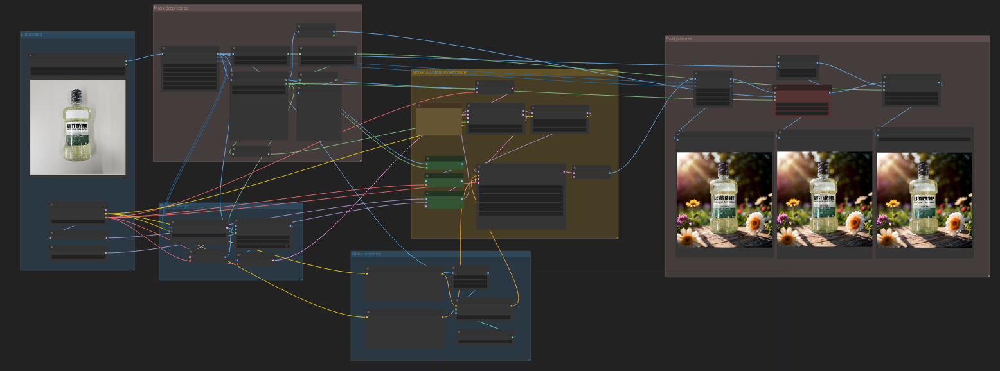
    
    [여기서](workflows/productfix_text.json) workflow를 다운로드 할 수 있습니다.
- **IC-Light + controlnet + IP-Adapter + Text transfer + Latent Injection**
    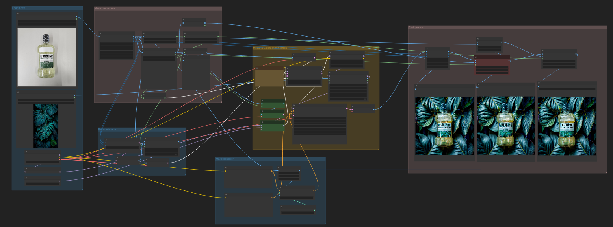

    [여기서](workflows/productfix_adapter.json) workflow를 다운로드 할 수 있습니다.

## 📚 Reference

This project is based on research and code from several papers and open-source repositories.

- IC-Light: https://github.com/lllyasviel/IC-Light
- kandinsky2.2: https://github.com/ai-forever/Kandinsky-2
- clip-skip: https://medium.com/@natsunoyuki/clip-skip-with-the-diffusers-library-b2b63f38a443
- Anton Razzhigaev, Arseniy Shakhmatov, Kandinsky: an Improved Text-to-Image Synthesis with Image Prior and Latent Diffusion, **arXiv**, 2023
- Chuanxia Zheng, Long Tung Vuong, Jianfei Cai, Dinh Phung, MoVQ: Modulating Quantized Vectors for High-Fidelity Image Generation, **arXiv**, 2022

## 📄 License
```
MIT License

Copyright (c) 2024 ml-favorfit-develop

Permission is hereby granted, free of charge, to any person obtaining a copy
of this software and associated documentation files (the "Software"), to deal
in the Software without restriction, including without limitation the rights
to use, copy, modify, merge, publish, distribute, sublicense, and/or sell
copies of the Software, and to permit persons to whom the Software is
furnished to do so, subject to the following conditions:

The above copyright notice and this permission notice shall be included in all
copies or substantial portions of the Software.

THE SOFTWARE IS PROVIDED "AS IS", WITHOUT WARRANTY OF ANY KIND, EXPRESS OR
IMPLIED, INCLUDING BUT NOT LIMITED TO THE WARRANTIES OF MERCHANTABILITY,
FITNESS FOR A PARTICULAR PURPOSE AND NONINFRINGEMENT. IN NO EVENT SHALL THE
AUTHORS OR COPYRIGHT HOLDERS BE LIABLE FOR ANY CLAIM, DAMAGES OR OTHER
LIABILITY, WHETHER IN AN ACTION OF CONTRACT, TORT OR OTHERWISE, ARISING FROM,
OUT OF OR IN CONNECTION WITH THE SOFTWARE OR THE USE OR OTHER DEALINGS IN THE
SOFTWARE.
```

## 📞 Contact
middlek - middlekcenter@gmail.com