# 🎨 ComfyUI-productfix

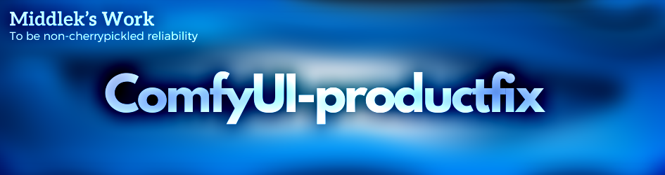
e-commerce 상품의 텍스트, 로고, 디테일 등을 유지하면서 이미지를 생성할 수 있도록 도와주는 ComfyUI 커스텀 노드입니다.


## 🎬 Demo


스마트폰으로 찍은 내 방 물건(색보정 X)들로 생성한 AI 이미지

## 📌 Index

- [Introduction](#-introduction)
- [Features](#-features)
- [Models and Custom Nodes](#-models-and-custom-nodes)
- [Application](#-application)
- [Approach](#-approach)
- [Install](#-install)
- [How to use](#-how-to-use)

## 🚀 Introduction

Stable diffusion으로 생성한 이미지는 시각적으로 자연스럽고 충실도가 높은 이미지를 생성하지만, 생성 과정에서 입력 객체가 변형되는 문제가 있습니다. 객체에 텍스트와 브랜드 로고 같이 인위적 규칙성을 가진 요소에서 이 문제가 특히 두드러집니다. 이런 **변형 문제는 e-commerce 환경에서 판매하는 실제 상품에 적용할 경우 심각한 제약**으로 작용합니다.

**Productfix**는 입력 객체의 특성(텍스트, 로고, 디테일 등)을 유지하면서 이미지를 생성할 수 있는 **Latent injection**이라는 AI application을 제공합니다. 또한 객체의 세부 사항을 보존하는데 도움이 되는 추가적인 노드 제공합니다. 

이 노드를 통해 기존의 디자인 툴(포토샵, 일러스트레이터 같은)로 해야만 했던 후처리 작업을 대폭 줄일 수 있을 것으로 기대합니다. ComfyUI에서 custom node를 통해 여러분의 워크플로우에 통합할 수 있습니다.

## 💡 Features

<details>
  <summary><strong>Apply Latent Injection</strong></summary>
  <ul>
    <li>ComfyUI의 KSampler 노드를 hijack하여 Latent injection을 수행하도록 설정합니다.</li>
    <li>실행이 완료되면 본래 KSampler 노드로 복구합니다.</li>
  </ul>
</details>

<details>
  <summary><strong>Get Text Mask</strong></summary>
  <ul>
    <li>Easy OCR 패키지를 이용하여 Text Mask를 Tensor로 불러오는 노드입니다.</li>
    <li>Easy OCR custom node는 이미 존재하지만(<a href="https://github.com/JaidedAI/EasyOCR">https://github.com/JaidedAI/EasyOCR</a>), PIL 패키지 사용방법이 stable하지 않기 때문에 이 노드 사용을 추천합니다.</li>
  </ul>
</details>

<details>
  <summary><strong>Reset Model Patcher Calculate Weight</strong></summary>
  <ul>
    <li>다른 node에서 Modelpatcher의 calculate weight 함수를 injection했다면 오류가 발생하는 custom node가 다수 존재합니다.(ex: comfyui-inpaint-nodes <a href="https://github.com/Acly/ComfyUI-Easy-Use">https://github.com/yolain/ComfyUI-Easy-Use.git</a>)</li>
    <li>이를 원본 Modelpatcher의 calculate weight로 reset하여 문제를 해결하는 노드입니다.</li>
  </ul>
</details>

## 📝 Models and Custom Nodes

### Models
- [realisticVisionV60B1_v51HyperVAE](https://huggingface.co/JCTN/Juggernaut/blob/main/realisticVisionV60B1_v51HyperVAE.safetensors)
- [ic light](https://huggingface.co/lllyasviel/ic-light/blob/main/iclight_sd15_fc.safetensors)
- [depth controlnet v1.1](https://huggingface.co/lllyasviel/ControlNet-v1-1/blob/main/control_v11f1p_sd15_depth.pth)
- [more detail lora](https://civitai.com/models/82098/add-more-details-detail-enhancer-tweaker-lora)

### Custom nodes
- [ComfyUI-productfix](https://github.com/MiddleKD/ComfyUI-productfix)
- [comfyui_controlnet_aux v1.0.7](https://github.com/Fannovel16/comfyui_controlnet_aux)
- [ComfyUI Impact Pack v8.14.2](https://github.com/ltdrdata/ComfyUI-Impact-Pack)
- [ComfyUI-Easy-Use v1.3.0](https://github.com/yolain/ComfyUI-Easy-Use)
- [ComfyUI_essentials v1.1.0](https://github.com/cubiq/ComfyUI_essentials)
- [ComfyUI-IC-Light-Native v1.0.1](https://github.com/huchenlei/ComfyUI-IC-Light-Native) **(not [ComfyUI-IC-Light](https://github.com/lllyasviel/IC-Light))**

## 🏃🏻‍♂️ Application
- ### **Comparing “IC-Light + Text” / “IC-Light + Text + Latent Injection”**
    
    condition / Input / IC-Light / **latent injection($\sigma_{end}$=1.0)** / **latent injection($\sigma_{end}$=0.5)**
    
    prompt: product photo, professional photography, realistic, leaf, outdoors / seed: 42

- ### **Comparing “IC-Light + IP-Adapter” / “IC-Light + IP-Adapter + Latent Injection”**
    
    condition / Input / IC-Light / **latent injection($\sigma_{end}$=1.0)** / **latent injection($\sigma_{end}$=0.5)**
    
    prompt: product photo, professional photography, realistic / seed: 42
    <br/><br/>
    Latent injection은 IC-Light와 IP-Adapter를 함께 사용할 때 진가를 발휘합니다.템플릿 스타일 이미지와 상품을 합성할 때 사용해보세요!
- ### **IC-Light + controlnet + text condition + Text transfer + Latent Injection**

    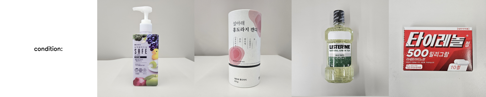
    Items in my room captured with my phone camera
    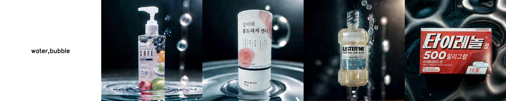
    prompt: product photo, professional photography, realistic, water, bubble / seed: 42 / controlnet: depth
    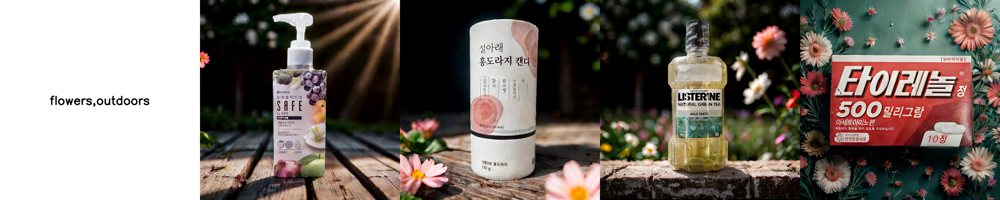
    prompt: product photo, professional photography, realistic, flowers, outdoors / seed: 42 / controlnet: depth
- ### **IC-Light + controlnet + IP-Adapter + Text transfer + Latent Injection**

    
    Items in my room captured with my phone camera

    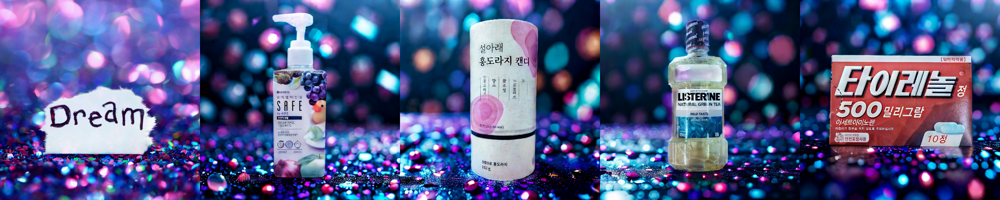

    prompt: product photo, professional photography, realistic / seed: 42 / controlnet: depth

    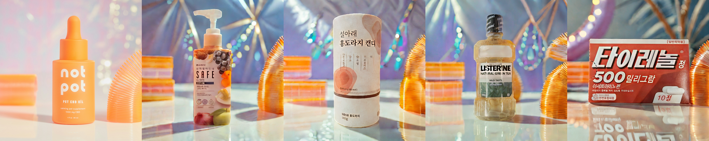
    prompt: product photo, professional photography, realistic / seed: 42 / controlnet: depth
- ### **Text transfer**

    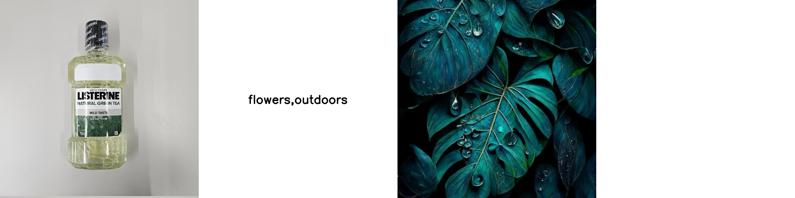
    Input / text condition / image condition(IP-Adapter)

    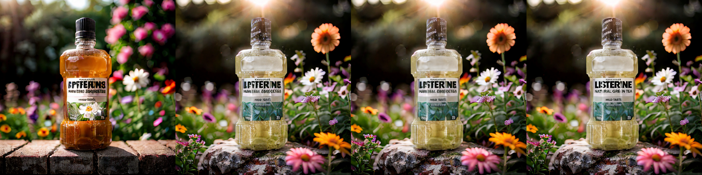
    only IC-Light / **Latent injection** / detail transfer / **Text transfer**
  
    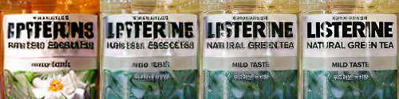
    close up
    <br/><br/>
    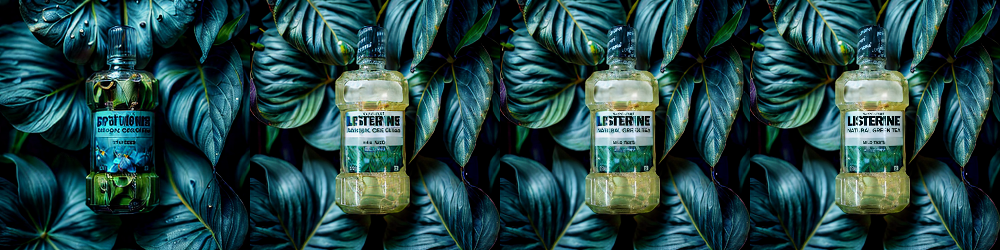
    only IC-Light / **Latent injection** / detail transfer / **Text transfer**
  
    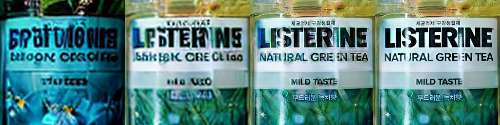
    close up
    <br/><br/>
    Text transfer는 입력 객체의 텍스트를 보존하기 위해 개발된 OCR 텍스트 마스크 기반 Detail transfer application입니다. `GetTextMask` node와 `DetailTransfer` node를 활용해 구현 가능합니다.

- ### **Upscaled results + Text detail transfer**
    


## 🛠 Approach

- ### Background: Inpainting
Diffusion 모델의 Inpainting은 마스크를 조건으로 이미지를 생성합니다. 각 샘플링 단계에서 마스크를 기준으로 원본과 생성된 잠재 공간을 합성합니다. 이 방법은 입력 객체를 유지하면서 마스크 영역을 생성할 수 있지만, **저품질 입력 객체(예: 스마트폰으로 촬영)의 경우 결과 이미지 품질도 저하되는 한계**가 있습니다.

- ### Background: IC-Light
IC-Light는 전경과 배경의 조명을 조작하는 혁신적인 Adapter Unet입니다. 입력 객체의 재조명을 통해 저품질 객체도 우수한 결과 이미지로 변환합니다. 그러나 **전경 생성 과정에서 객체 세부 사항이 변형되는 문제**는 여전히 존재합니다.

- ### Background: Kandinsky Inpainting Process
Kandinsky diffusion inpainting은 일반적인 inpainting과 차이가 있습니다. 샘플링 단계마다 잠재 공간을 합성할 때, **원본 대신 scheduler의 sigma 값에 따른 노이즈가 추가된 잠재 공간을 사용**합니다. 이 방식은 일관된 노이즈를 통해 품질 향상을 이끌어냅니다.

- ### Background: CLIP Skip
CLIP Skip은 텍스트 조건을 적용할 때, **샘플링 과정의 마지막 단계까지 적용하지 않고 중간에 중단하는 추론 방법**입니다. 이는 조건을 제어하여 전체 맥락에 부합하는 결과 이미지를 생성하는 효과가 있습니다.

- ### Solution: Latent injection
    
    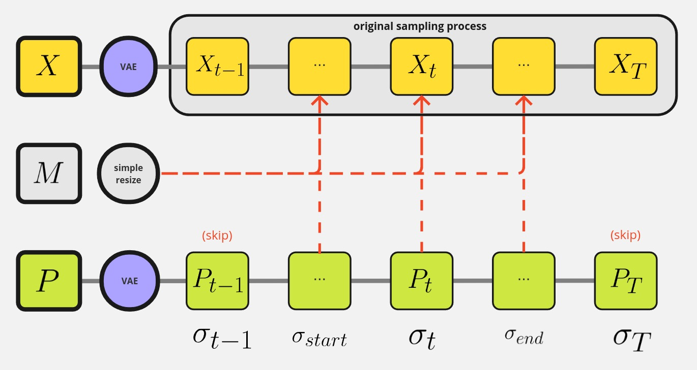
    
    
    
    $X_t$ : sample
    
    $M$ : product mask
    
    $P$ : product latent
    
    $CO$ : composition operation(ex: add, overlay, soft light etc.)
    
    입력 객체의 특징 보존과 의미 있는 조명 변화를 동시에 달성하기 위해 복합적인 전략을 적용합니다. **샘플링 과정에서 노이즈가 추가된 잠재 공간을 복합 연산하여 객체의 세부 특징을 유지**합니다. 또한 IC-Light의 전역적 조명 변화 특성을 반영하기 위해 **샘플링의 초기와 후기 단계를 선택적으로 건너뜁니다.** 이 방식은 scheduler의 sigma 값을 기준으로 작동하기 때문에 다양한 scheduler 유형에 대해 안정적인 성능을 보장합니다. 결과적으로 객체의 고유한 특성을 보존하면서도 조명 효과를 유동적으로 적용할 수 있습니다.
    

## 📥 Install

```bash
cd custom_nodes
git clone {this repository}
pip install -r requirements.txt
```

## 🖥 How to use

### **ComfyUI-workflows**

- **IC-Light + controlnet + text condition + Text transfer + Latent Injection**
    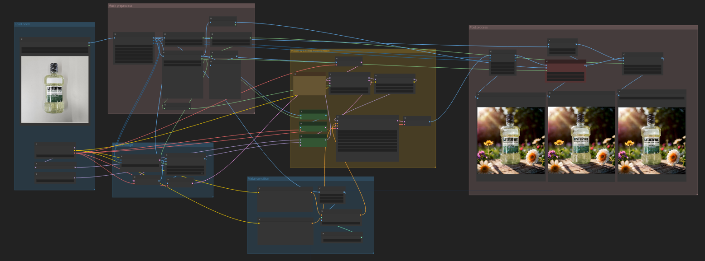
    
    [여기서](workflows/productfix_text.json) workflow를 다운로드할 수 있습니다.

- **IC-Light + controlnet + IP-Adapter + Text transfer + Latent Injection**
    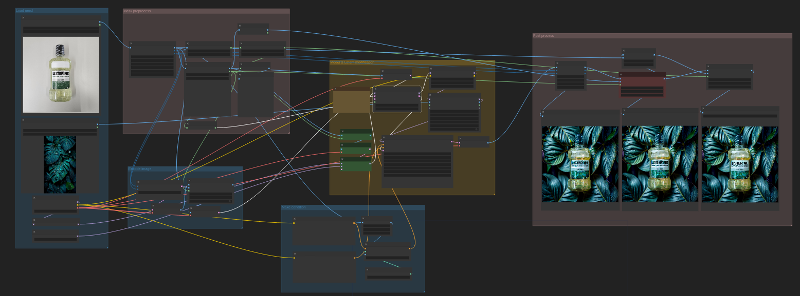

    [여기서](workflows/productfix_adapter.json) workflow를 다운로드 할 수 있습니다.

### **demo example assets**
- [product example image](assets/demo_example/pr_example.png)
- [style example image](assets/demo_example/style_example.jpg)

## 📚 Reference

This project is based on research and code from several papers and open-source repositories.

- IC-Light: https://github.com/lllyasviel/IC-Light
- kandinsky2.2: https://github.com/ai-forever/Kandinsky-2
- clip-skip: https://medium.com/@natsunoyuki/clip-skip-with-the-diffusers-library-b2b63f38a443
- Anton Razzhigaev, Arseniy Shakhmatov, Kandinsky: an Improved Text-to-Image Synthesis with Image Prior and Latent Diffusion, **arXiv**, 2023
- Chuanxia Zheng, Long Tung Vuong, Jianfei Cai, Dinh Phung, MoVQ: Modulating Quantized Vectors for High-Fidelity Image Generation, **arXiv**, 2022
